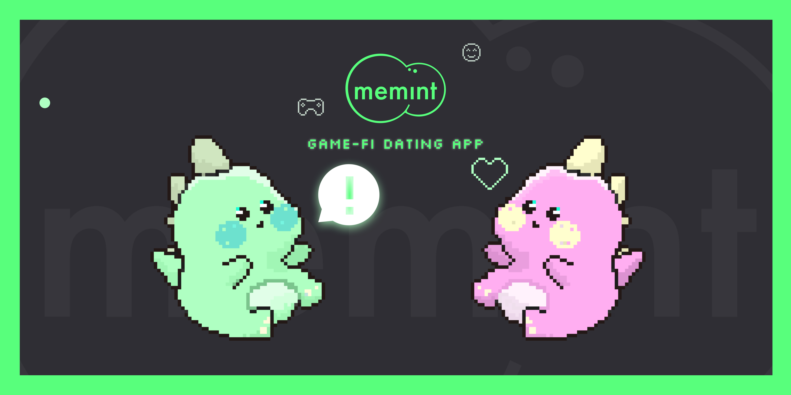

## Vision

Memint is Klaytn based Game-Fi Dating App that rewards users for group dating. Players can join group dating and make new friends in our application. Memint aims to make sound dating culture by building a safe, reliable, and sustainable community. We solve this with game-fi and group dating. Our rewards enable players to take positive behaviors to sustain the community. We believe these positive network effects would be a great opportunity that attracts non-crypto users to the crypto world.

## Description

## Problem
With the growing scale of untact society, the need for dating apps is increasing. Over 323 million people use dating apps worldwide. And just in 2021 alone, the online dating market is valued at 6Billion dollars. The dating app has become a source of entertainment, enjoyed by many users. However, dating apps also have many problems like Fake profiles, crime, fraud, etc. And Dating app companies also cheat for short-term profits.

## Solution
The traditional problem with dating apps comes from the disharmony of the community and users. We are going to solve these problems by synchronizing their stake of them. For a good user, more benefits would be given.

**MEMINT is a crypto game app that rewards users for group dating.**

‘Game-Fi’ and ‘Group Dating’, These two factors differentiate Memint from existing web2 dating apps.

**💙 Group Dating**

Group Dating is a kind of Blind Date. It is a familiar blind dates format in Korea and Japan. It’s easy to understand that group dating is an N-on-N dating, While the existing blind date is one on one.

Group datings have more functions than 1:1 blind dating.

In group dating, we usually participate with friends, so even if you meet strangers, you can rest assured knowing that you have someone accountable. Also, It is regarded as an activity where you can hang out with your friends while enjoying dating in a more relaxed atmosphere.
Group dating allows us to make new friends. That's because there is less pressure on romantic relationships than blind dates.
We saw that these two key points play an important role in building a sustainable and safe environment for our users. Unlike existing dating apps that users can quickly delete when they find another half, In our app, users can make new friends at any time, and stay for as long as they want to hang out. From the user’s perspective, staying for a longer period will function as an incentive to manage their reputation and do good to other users.

**🕹 Game-Fi**

Our goal is to build a community where users can make new friends easily and reliably. While our community affects our users, our community is affected by our users. Therefore, We adopted Game-Fi that strongly encourages players’ behavior.

Our rewards, like TING token, NFT Avatar, and Items, enable players to take positive behaviors to sustain the community. These positive behaviors have a positive network effect. We expect an increase of users through the various games and events, bringing entertainment in the midst. Likewise, the usage of cryptocurrency in our platform will allow our users to safely and conveniently use it. Ultimately making this platform a hot trend that many people will use.

## Roadmap
  1. September 2022 : closed beta releases
  2. November 2022 : open beta releases
We adopted an agile approach. After the release closed beta, we are going to take it for a test. We will test whether the Game-Fi group dating app provides value to users, and we will continuously modify the service based on our user feedback and market conditions.

We are preparing our closed beta app for app store distribution. Our app is in the process of reviewing. You can download our mobile application on the apple testflight link attached below.

**[🔗 WEB](https://bit.ly/3eqlyG4)**

**[📼PITCHDECK & DEMO](https://bit.ly/3ALW90Z)**

**[📱IOS APP (Testflight)](https://apple.co/3ebQ06v)**

